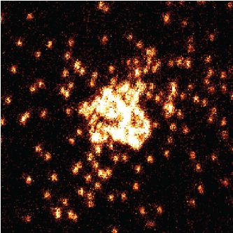
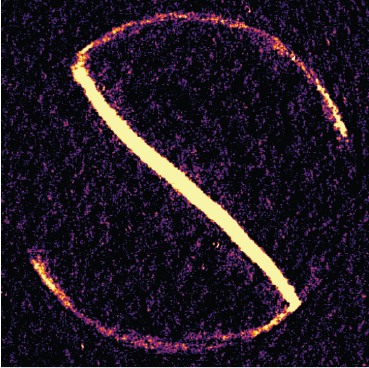
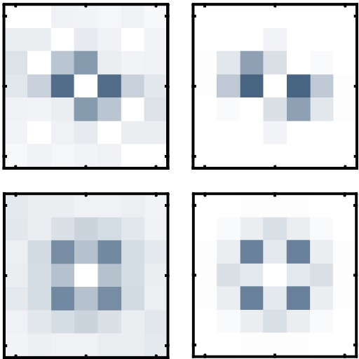
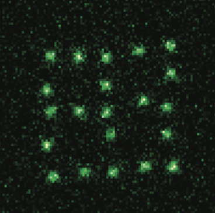
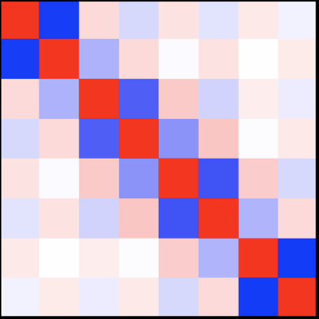

I'm a Ph.D. candidate student at MIT Physics. I am currently working at [Ultracold Quantum Gases Group](https://quantumgas.mit.edu/) in [MIT-Harvard Center for Ultracold Atoms](http://cua.mit.edu). My research interest is in the quantum simulation of strongly correlated system using ultracold atoms and molecules.

---

## Publications

{: width="100px" style="float:left; padding-right:15px" } **Measuring pair correlations in Bose and Fermi gases via atom-resolved microscopy.** 
R. Yao, **<u>S. Chi</u>**, M. Wang, R. J. Fletcher, M. Zwierlein. [_To be published_ ??? ??? ??? (2025)](https://).

{: width="100px" style="float:left; padding-right:15px" } **Observation of chiral edge transport in a rapidly-rotating quantum gas.** 
R. Yao, **<u>S. Chi</u>**, B. Mukherjee, A. Shaffer, M. Zwierlein, R. J. Fletcher. [_Nat. Phys._ 20, 1726–1731 (2024)](https://www.nature.com/articles/s41567-024-02617-7).

{: width="100px" style="float:left; padding-right:15px" } **Probing site-resolved correlations in a spin system of ultracold molecules**  
L. Christakis, J. S. Rosenberg, R. Raj, **<u>S. Chi</u>**, A. Morningstar, D. A. Huse, Z. Z. Yan, and W. S. Bakr. [_Nature_ 614 (7946), 64-69 (2023)](https://www.nature.com/articles/s41586-022-05558-4).

{: width="100px" style="float:left; padding-right:15px" } **Two-dimensional programmable tweezer arrays of fermions.** 
Z. Z. Yan, B. M. Spar, M. L. Prichard, **<u>S. Chi</u>**, H. Wei, E. Ibarra-Garc ́ıa-Padilla, K. R. A. Hazzard, W. S. Bakr. [_Phys. Rev. Lett._ 129, 123201 (2022)](https://journals.aps.org/prl/abstract/10.1103/PhysRevLett.129.123201).

{: width="100px" style="float:left; padding-right:15px" } **Realization of a Fermi-Hubbard Optical Tweezer Array.** 
B. M. Spar, E. Guardado-Sanchez, **<u>S. Chi</u>**, Z. Z. Yan, W. S. Bakr. [_Phys. Rev. Lett._ 128, 223202 (2022)](https://journals.aps.org/prl/abstract/10.1103/PhysRevLett.128.223202).